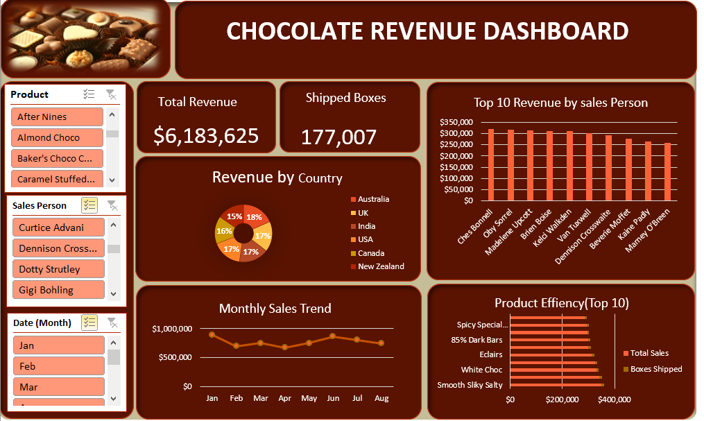

🍫 Chocolate Sales Performance Dashboard
📊 Project Overview

This project presents an interactive Excel Business Intelligence dashboard analyzing $6.18M in revenue and 177,007 boxes shipped between January and August 2022.

The dashboard was built to simulate executive-level reporting, providing clear visibility into sales performance, geographic distribution, product efficiency, and individual sales contributions.

🎯 Business Objective

To transform raw sales data into actionable insights that support:

Revenue performance monitoring

Sales team evaluation

Product optimization decisions

Geographic market analysis

Trend identification and forecasting

🛠 Tools & Techniques Used

Microsoft Excel

PivotTables

Slicers

KPI Cards

Line & Bar Charts

Data Cleaning & Transformation

Exploratory Data Analysis (EDA)

Business Intelligence Reporting

📈 Key Dashboard Features

KPI Section

Total Revenue

Total Boxes Shipped

Monthly Sales Trend

Identifies seasonal patterns and revenue fluctuations

Revenue by Country

Evaluates geographic diversification and contribution

Top 10 Sales Representatives

Highlights high-performing individuals and revenue concentration

Product Efficiency Analysis

Compares revenue vs. units shipped to assess product performance

Interactive Slicers

Dynamic filtering by Product, Salesperson, and Month

🔎 Key Insights

Revenue performance remained stable with a mid-year peak.

Sales contribution is well distributed among top performers.

Premium and dark chocolate products drive strong revenue.

Geographic diversification reduces market dependency risk.

📷 Dashboard Preview

🚀 Future Improvements

Add Profit & Margin analysis

Implement Target vs. Actual performance tracking

Convert to Power BI for enhanced interactivity

Automate data refresh using Power Query

📌 Project Type

Business Intelligence | Sales Analytics | Excel Dashboard | Data Analysis Portfolio Project
